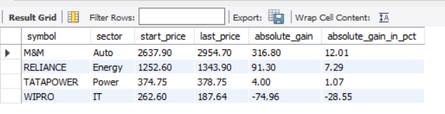
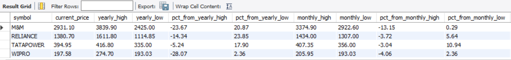
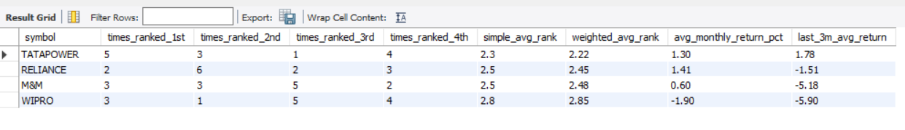
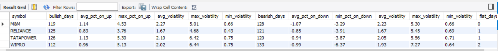
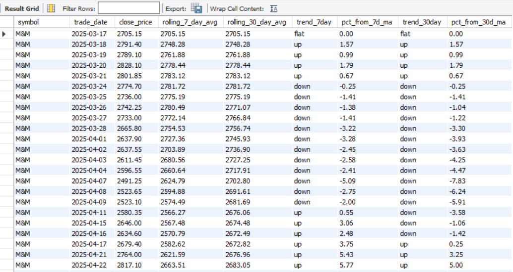

# 📈 Big 4 — NSE Pulse-Stock Performance Analytics Engine
**Advanced SQL Analysis · 1 Year · 4 Nifty 50 Stocks · 988 Rows · 11 Business Queries**


---

## 🎯 What This Project Is

I have a background in business development and finance, and I've always been drawn to how data drives decisions in high-stakes environments. I built this project to bridge that instinct with structured SQL analytics — taking raw NSE equity data and turning it into the kind of performance signals that investment teams, product analysts, and BI engineers actually use.

This is not a textbook exercise. It’s a sophisticated analytical pipeline built on MySQL. Every query answers a question a business stakeholder would genuinely ask.

---

## 📦 Dataset

| | |
|---|---|
| **Source** | NSE India Official Portal — not Kaggle |
| **Stocks** | RELIANCE · WIPRO · TATAPOWER · M&M |
| **Sectors** | Energy · IT · Power · Auto |
| **Period** | 17 Mar 2025 → 13 Mar 2026 |
| **Rows** | 988 (247 trading days × 4 stocks) |


---

## 🏗️ Schema

Two-table normalised design with foreign key enforcement:

```
stocks  →  symbol (PK) · company_name · sector
prices  →  symbol (FK) · trade_date · open · high · low · close · avg_price · volume · no_of_trades
```

Static metadata lives once in `stocks`. All 988 rows of time-series data live in `prices`. Clean, scalable, production-ready.

---

## 🔍 Analysis — 11 Business Queries

| # | Business Question | SQL Concepts |
|---|---|---|
| Q1 | Biggest single-day price gain — date and stock | Calculated columns · ORDER BY · LIMIT |
| Q2 | Monthly average trading volume per stock | DATE_FORMAT · AVG · GROUP BY |
| Q3 | Monthly close price trend — high, low, avg | Multi-column GROUP BY · MIN / MAX / AVG |
| Q4 | Monthly volatility — intraday swing % | Expression inside AVG · WHERE filter |
| Q5 | Bullish vs bearish days — count, avg move %, volatility split | CASE WHEN inside COUNT and AVG · Conditional aggregation |
| Q6 | Annual return — absolute gain and % by sector | 3-table JOIN · CTE · Subquery |

| Q7 | Day-over-day price change for every trading day | LAG() · PARTITION BY · Window ORDER BY |
| Q8 | Monthly performance rank — which stock led each month? | FIRST_VALUE() · RANK() OVER PARTITION BY · DISTINCT |
| Q9 | Recency-weighted scorecard — recent form matters more | 4 stacked CTEs · ROW_NUMBER() · Weighted AVG · Conditional AVG |
| Q10 | 7-day and 30-day rolling average with trend signal | AVG() OVER ROWS BETWEEN · CASE WHEN trend flag · % from MA |
| Q11 | Distance from 52-week / monthly / weekly high and low | 6 stacked CTEs · Multi-timeframe JOIN · Subquery inside JOIN |


---

## 💡 Three Findings Worth Highlighting  "Secret Sauce"

**1. Recency weighting surfaces what simple averages hide**
Q9 assigns higher weight to recent months. The gap between a stock's simple average rank and its weighted rank tells you whether it's building momentum or fading — something a flat average completely misses.


**2. Bullish days alone don't tell the full story**
Q5 goes beyond counting green candles. It separates the average % move and volatility on up days vs down days per stock. A stock can have more bullish days but still be riskier — because its down days move harder.


**3. Rolling average crossovers in pure SQL**
Q10 calculates 7-day and 30-day moving averages and flags whether each day's close is above or below each average. No Python, no charting library — the trend signal lives inside the database.


---

## 🛠️ Technical Stack

- **MySQL 8.0** — all analysis in pure SQL
- **MySQL Workbench** — schema design and query execution
- **Python** (pandas · pymysql) — data cleaning and loading pipeline
- **NSE India** — official data source

---

## 📁 Structure

```
nse-stock-analytics/
├── README.md
├── data/
    └── MM.csv
    └── RELIANCE.csv
    └── TATAPOWER.csv
    └── WIPRO.csv
├── schema/
│   └── 01_full_nse_project.sql
├── analysis/
│   └── 02_big4 _stock_analysis_queries.sql
└── outputs/
    └── screenshots/
```

---

## ▶️ How to Run This Project

1. **Initialize Database**: 
   - Run `CREATE DATABASE nse_analysis;`
   - Use the database: `USE nse_analysis;`
2. **Setup Schema**: 
   - Execute the script `schema/01_full_nse_project.sql` to create the table structure.
3. **Import Data**: 
   - Right-click the `prices` table in MySQL Workbench and select **Table Data Import Wizard**.
   - Select the `prices.csv` file.
   - **Important**: In the column mapping, set `price_id` to **"Skip"** (it is auto-generated) and ensure all other columns match the table headers.
4. **Run Analysis**: 
   - Open and run `analysis/big4_stock_analysis_queries.sql` to see the Golden Cross, 30-day MA, and Monthly Ranking reports.

---

## 👤 About Me

I come from a decade of business development, client management, and financial data environments. I'm now channelling that domain knowledge into data analytics — with a focus on roles where analytical rigour meets real business context.

📫 Let's Connect , 
I am actively seeking opportunities to apply this level of analytical rigor to a professional Data Team.


📧 akash.pshaw524@gmail.com
🔗https://www.linkedin.com/in/akashshaw524/
GitHub: (https://github.com/akashpshaw524)
📍 Kolkata, India · Open to remote and relocation
